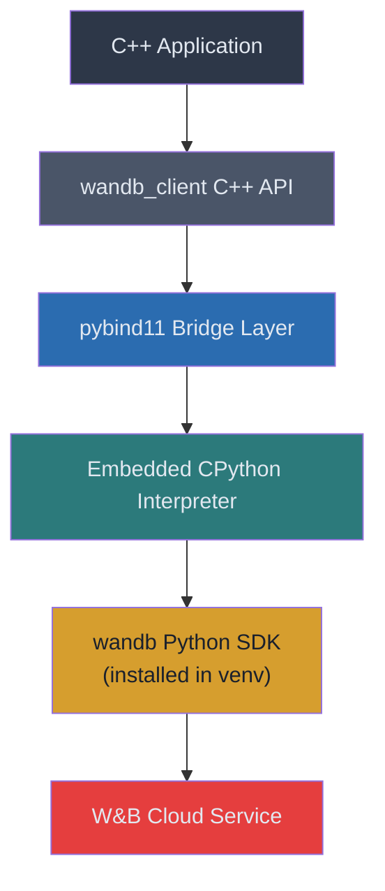
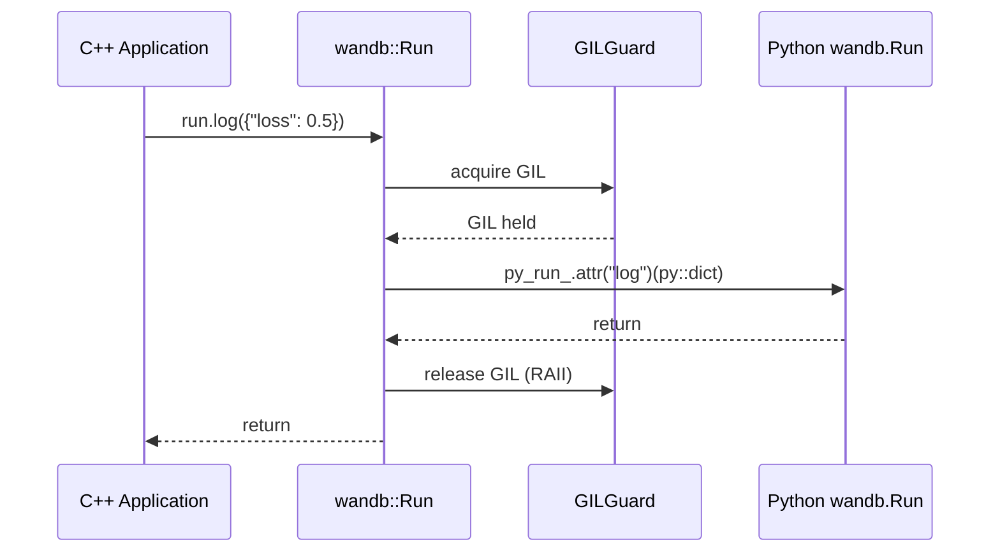
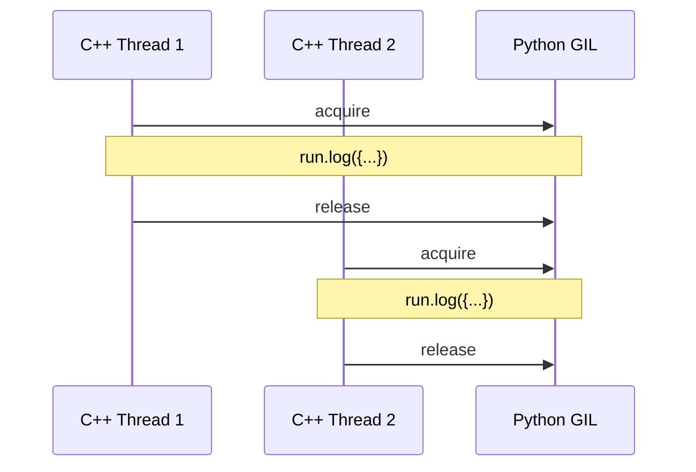

# WandB C++ Client Bridge — Design Document

## 1. Overview

This project provides a **C++ interface that bridges to the wandb Python SDK** via [pybind11](https://github.com/pybind/pybind11). It enables C++ ML training pipelines to log metrics, manage artifacts, use model registries, and track experiments — all without writing Python.

### Scope

| In Scope | Out of Scope |
|---|---|
| Runs, logging, experiment tracking | wandb Weave |
| Artifacts (create, log, download, version) | Real-time streaming/media logging |
| Model registry (collections, versioning) | wandb Reports/Workspaces API |
| Hyperparameter config management | Custom wandb Integrations |
| CPU/GPU system utilization monitoring | Multi-language bindings (Go, Rust, etc.) |

---

## 2. Architecture



### 2.1 Key Design Decisions

| Decision | Rationale |
|---|---|
| **pybind11 (not raw CPython C API)** | Type-safe, RAII-friendly, minimal boilerplate |
| **Embedded interpreter** | No separate Python process; direct in-process calls with lower latency |
| **Thin wrapper pattern** | Each C++ class holds a `py::object` referencing its Python counterpart |
| **Centralized GIL management** | `PyRuntime` singleton owns interpreter lifecycle; `GILGuard` RAII wraps GIL acquisition |
| **Project-local venv** | Python deps installed to `wandb_client/venv` for isolation |

### 2.2 Data Flow



---

## 3. Directory Layout

```
wandb_client/
├── CMakeLists.txt              # Top-level build config
├── AGENTS.md                   # Project conventions
├── README.md                   # Quick-start guide
├── docs/
│   ├── design.md               # This document
│   └── roadmap.md              # Implementation roadmap
├── venv/                       # Python virtual environment (gitignored)
├── include/
│   └── wandb_client/
│       ├── wandb.h             # Master include (convenience)
│       ├── py_runtime.h        # Python interpreter manager
│       ├── run.h               # wandb::Run
│       ├── config.h            # wandb::Config
│       ├── artifact.h          # wandb::Artifact
│       ├── registry.h          # wandb::Registry
│       ├── api.h               # wandb::Api (Public API)
│       └── metrics.h           # Metrics + system monitor
├── src/
│   ├── CMakeLists.txt          # Library target
│   ├── py_runtime.cc
│   ├── run.cc
│   ├── config.cc
│   ├── artifact.cc
│   ├── registry.cc
│   ├── api.cc
│   └── metrics.cc
└── tests/
    ├── CMakeLists.txt          # Test targets (GoogleTest)
    ├── test_py_runtime.cc
    ├── test_run.cc
    ├── test_config.cc
    ├── test_artifact.cc
    ├── test_registry.cc
    ├── test_api.cc
    └── test_metrics.cc
```

---

## 4. C++ API Surface

### 4.1 Python Runtime (`py_runtime.h`)

Owns the CPython interpreter lifecycle and GIL helpers.

```cpp
class PyRuntime {
public:
    static PyRuntime& instance();             // Singleton access
    void initialize();                        // Start interpreter
    void finalize();                          // Stop interpreter
    bool is_initialized() const;
    py::object import(const std::string& module);  // Cached import
};

class GILGuard {                              // RAII GIL acquisition
public:
    GILGuard();
    ~GILGuard();
};
```

### 4.2 Run & Config (`run.h`, `config.h`)

| C++ Method | Python Equivalent |
|---|---|
| `Run::init(RunConfig)` | `wandb.init(project, entity, config, ...)` |
| `Run::login(key)` | `wandb.login(key)` |
| `run.log(metrics, step, commit)` | `run.log(dict, step, commit)` |
| `run.log_table(key, cols, data)` | `run.log({"key": wandb.Table(...)})` |
| `run.set_summary(key, val)` | `run.summary["key"] = val` |
| `run.update_config(params)` | `run.config.update(dict)` |
| `run.log_artifact(artifact)` | `run.log_artifact(artifact, aliases, tags)` |
| `run.use_artifact(name)` | `run.use_artifact("name:alias")` |
| `run.link_artifact(artifact, path)` | `run.link_artifact(artifact, target_path)` |
| `run.finish()` | `run.finish()` |
| `run.id()` / `run.name()` / `run.url()` | `run.id` / `run.name` / `run.url` |

```cpp
struct RunConfig {
    std::string project, entity, name, notes, group, job_type, resume, fork_from;
    std::map<std::string, std::string> config;
    std::vector<std::string> tags;
};
```

### 4.3 Artifacts (`artifact.h`)

| C++ Method | Python Equivalent |
|---|---|
| `Artifact(name, type)` | `wandb.Artifact(name, type)` |
| `add_file(path, name)` | `artifact.add_file(local_path, name)` |
| `add_dir(path, name)` | `artifact.add_dir(local_path, name)` |
| `add_reference(uri, name)` | `artifact.add_reference(uri, name)` |
| `download(root, prefix)` | `artifact.download(root, path_prefix)` |
| `set_aliases(aliases)` | `artifact.aliases = [...]` |
| `set_ttl(days)` | TTL policy via SDK |
| `save()` | `artifact.save()` |

### 4.4 Registry & Public API (`registry.h`, `api.h`)

| C++ Method | Python Equivalent |
|---|---|
| `Api()` | `wandb.Api()` |
| `api.artifact(name)` | `api.artifact("entity/project/artifact:v")` |
| `api.create_registry(name, vis)` | `api.create_registry(name, visibility)` |
| `Registry::link_artifact_to_collection(...)` | `run.link_artifact(artifact, target_path)` |
| `Registry::retrieve_from_collection(...)` | `api.artifact("wandb-registry-name/col:v")` |
| `Registry::set_collection_description(...)` | `api.artifact_collection(...).description = ...` |

### 4.5 Metrics & System Monitoring (`metrics.h`)

```cpp
namespace wandb::metrics {
    class TrainingTimer;      // RAII timer → logs elapsed as metric
    struct SystemMetrics;     // CPU%, mem%, GPU util/mem
    SystemMetrics collect_system_metrics();  // Via Python psutil/pynvml
    class SystemMonitor;      // Background thread, periodic logging
}
```

---

## 5. Threading & GIL Model

All wandb Python calls happen under GIL via `GILGuard`. Multiple C++ threads can call wandb methods, but they serialize on the GIL. The GIL is released after each call via RAII, so non-wandb C++ computation runs freely in parallel.



---

## 6. Dependencies

| Dependency | Role | How Provided |
|---|---|---|
| **Python ≥ 3.13** | Interpreter for wandb SDK | System or venv |
| **pybind11 ≥ 2.13** | C++/Python bridge | CMake FetchContent |
| **wandb == 0.24.2** | W&B Python SDK | `pip install` into `venv/` |
| **psutil** (optional) | CPU/memory metrics | `pip install` into `venv/` |
| **GoogleTest** | Unit testing | CMake FetchContent |

---

## 7. Error Handling Strategy

Python exceptions are caught at the bridge boundary and converted to C++ exceptions:

```cpp
class WandbException : public std::runtime_error {
public:
    using std::runtime_error::runtime_error;
};

// In bridge methods:
try {
    py_run_.attr("log")(py_dict);
} catch (py::error_already_set& e) {
    throw WandbException(e.what());
}
```

---

## 8. Testing Strategy

- **Framework**: GoogleTest
- **1:1 file mapping**: Each `src/*.cc` has a corresponding `tests/test_*.cc`
- **Offline mode**: Tests use `WANDB_MODE=offline` (no network calls)
- **Coverage target**: >60%
- **CI**: `cmake --build build && cd build && ctest --output-on-failure`
