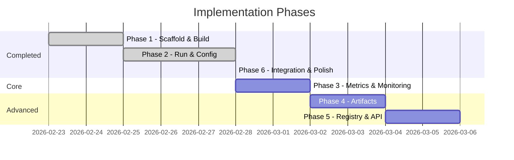

# WandB C++ Client Bridge — Implementation Roadmap

> Phased delivery plan with clear exit criteria per phase. Each phase is independently testable and buildable.

---

## ~~Phase 1: Project Scaffolding & Build System~~

**Goal**: Repository is buildable, venv with wandb SDK is set up, and a minimal "hello pybind11" target compiles and links.

### Features
- [ ] Top-level `CMakeLists.txt` with C++17, pybind11 (FetchContent), Python3 discovery
- [ ] `src/CMakeLists.txt` — `wandb_client` static library target (empty placeholder sources initially)
- [ ] `tests/CMakeLists.txt` — GoogleTest via FetchContent, skeleton test target
- [ ] Python venv at `wandb_client/venv` using Python ≥ 3.13
- [ ] `requirements.txt` listing `wandb==0.24.2` and optionally `psutil`
- [ ] `AGENTS.md` — project conventions
- [ ] Updated `.gitignore` — `build/`, `venv/`, `__pycache__/`, `wandb/`, IDE files
- [ ] `README.md` — build prerequisites and quickstart instructions
- [ ] Skeleton `include/wandb_client/py_runtime.h` + `src/py_runtime.cc` — interpreter init/finalize
- [ ] Skeleton `tests/test_py_runtime.cc` — verify interpreter starts and `import wandb` succeeds

### Exit Criteria
1. `cmake -B build && cmake --build build` completes with zero errors
2. `cd build && ctest --output-on-failure` passes — test confirms Python interpreter initializes and `import wandb` succeeds
3. `venv/` contains a working Python environment with `wandb` importable

---

## ~~Phase 2: Core Bridge — Run & Config~~

**Goal**: C++ code can initialize a wandb run, log scalar metrics, set config/summary, and finish.

### Features
- [ ] `include/wandb_client/config.h` — `RunConfig` struct
- [ ] `include/wandb_client/run.h` / `src/run.cc` — `Run::init()`, `Run::login()`, `run.log()`, `run.set_summary()`, `run.update_config()`, `run.finish()`, property accessors (`id`, `name`, `url`)
- [ ] `include/wandb_client/config.h` / `src/config.cc` — C++ → Python dict conversion
- [ ] `tests/test_run.cc` — init/log/summary/config/finish in offline mode
- [ ] `tests/test_config.cc` — RunConfig construction and conversion

### Exit Criteria
1. All tests pass in `WANDB_MODE=offline`
2. A run directory is created locally by wandb (confirming metrics were logged)
3. `run.id()`, `run.name()` return valid strings

---

## Phase 3: Metrics & System Monitoring

**Goal**: C++ code can configure wandb's native system monitoring and measure code-section latencies.

### Features
- [ ] `RunConfig::stats_sampling_interval` — expose `wandb.Settings(x_stats_sampling_interval=...)` to tune native CPU/GPU/memory sampling rate (default 15s)
- [ ] `include/wandb_client/metrics.h` / `src/metrics.cc`
  - `TrainingTimer` — RAII scoped timer that measures wall-clock elapsed time and logs duration via `run.log()`
- [ ] `tests/test_metrics.cc` — timer accuracy, integration with `run.log()`
- [ ] *(Optional / Future)* `ScopedTrace` — hierarchical span tree for nested code profiling with per-span latency logging

### Exit Criteria
1. All metrics tests pass
2. `stats_sampling_interval` is forwarded to `wandb.init(settings=...)` correctly
3. `TrainingTimer` logs wall-clock duration to within ±50ms accuracy
4. Native system metrics (CPU/GPU) appear in the wandb dashboard "System" tab

---

## Phase 4: Artifacts

**Goal**: C++ code can create, populate, log, download, and manage artifacts (aliases, tags, TTL).

### Features
- [ ] `include/wandb_client/artifact.h` / `src/artifact.cc` — full `Artifact` class
  - `Artifact(name, type)`, `add_file()`, `add_dir()`, `add_reference()`
  - `download()`, `get_entry()`
  - `set_aliases()`, `aliases()`, `add_tag()`, `set_ttl()`
  - `set_description()`, `set_metadata()`, `save()`
- [ ] `run.log_artifact()`, `run.use_artifact()` integration in `Run`
- [ ] `tests/test_artifact.cc` — create, add file, log, download flow in offline mode

### Exit Criteria
1. All artifact tests pass
2. `run.log_artifact()` writes artifact data to the local wandb offline dir
3. `artifact.download()` returns a valid local path

---

## Phase 5: Registry & Public API

**Goal**: C++ code can interact with the wandb model registry and query data via the Public API.

### Features
- [ ] `include/wandb_client/api.h` / `src/api.cc` — `Api()`, `artifact()`, `run()`, `artifact_collection()`, `create_registry()`, `registry()`
- [ ] `include/wandb_client/registry.h` / `src/registry.cc` — `Registry` helper class
  - `link_artifact_to_collection()`, `retrieve_from_collection()`
  - `set_collection_description()`, `add_collection_tags()`
- [ ] `run.link_artifact()` integration in `Run`
- [ ] `tests/test_api.cc` — Api construction, artifact retrieval
- [ ] `tests/test_registry.cc` — collection linking, description, tags

### Exit Criteria
1. All registry/API tests pass
2. `run.link_artifact()` succeeds (offline or mocked)
3. `Api().artifact()` returns a valid `Artifact` object (requires live or mock)

## ~~Phase 6: Integration Testing & Polish~~

**Goal**: End-to-end validation against a live W&B account, documentation complete.

### Features
- [ ] Integration test script (manual) — init run, log metrics loop, create artifact, link to registry, collect system metrics, finish run
- [ ] Verify data appears correctly on W&B dashboard
- [ ] `README.md` finalized with full API reference and usage examples
- [ ] CI build script (optional)

### Exit Criteria
1. Manual integration test creates a visible run on W&B dashboard with:
   - Plotted scalar metrics
   - Attached artifact
   - System utilization charts
2. All unit tests pass (`ctest`)
3. >60% unit test coverage

---

## Summary Timeline

| Phase | Est. Duration | Cumulative |
|---|---|---|
| ~~1 — Scaffolding~~ | Done | Done |
| ~~2 — Run & Config~~ | Done | Done |
| 3 — Metrics | 2 days | 2 days |
| 4 — Artifacts | 2 days | 4 days |
| 5 — Registry & API | 2 days | 6 days |
| ~~6 — Polish~~ | Done | Done |
